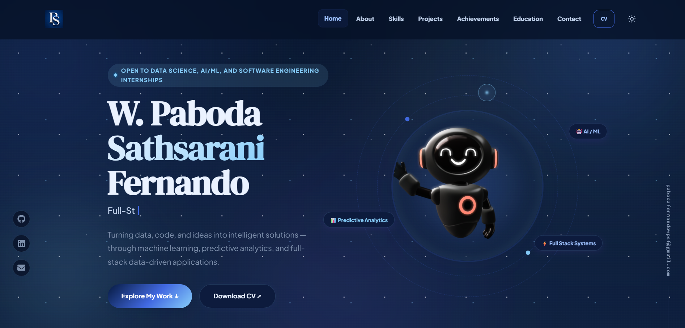

# 🌐 Paboda Sathsarani Fernando — Portfolio

<div align="center">


<br/>

<p>
  <b>A modern, responsive personal portfolio website showcasing my projects, skills, achievements, education, and contact details.</b>
</p>

<p>
  <a href="https://paboda-portfolio.vercel.app/" target="_blank">
    
  </a>
  <a href="https://github.com/PabodaFdo" target="_blank">
    
  </a>
  <a href="mailto:pabodafernandowpsf@gmail.com">
    
  </a>
</p>

</div>

---

## 📌 About This Portfolio

This portfolio was built to present my academic background, technical skills, software engineering projects, AI/ML interests, achievements, and contact information in a clean and professional way.

I am a third-year **BSc (Hons) Information Technology undergraduate at SLIIT**, specializing in **Data Science**. I am interested in building practical software systems, data-driven applications, AI-supported solutions, dashboards, and full-stack products that solve real-world problems.

---

## 🚀 Live Demo

🔗 **Portfolio Website:**
https://paboda-portfolio.vercel.app/

---

## ✨ Key Features

* 🌗 Dark and light theme support
* 🤖 Animated hero section with 3D robot visual
* 🎯 Smooth custom cursor animation
* 🧠 Skills marquee animation
* 💼 Featured project showcase
* 🏆 Achievements and certifications section
* 🎓 Education timeline
* 📩 Direct email contact section
* 🧭 Footer and side rail navigation
* 📱 Fully responsive design for desktop, tablet, and mobile

---

## 🛠️ Tech Stack

<div align="center">

| Category            | Technologies              |
| ------------------- | ------------------------- |
| Frontend            | React, Vite, JavaScript   |
| Styling             | CSS3, Responsive Design   |
| UI / Icons          | React Icons, Lucide React |
| Animation / Visuals | CSS Animations, Spline 3D |
| Deployment          | Vercel                    |
| Version Control     | Git, GitHub               |

</div>

---

## 📂 Main Sections

* Home
* About
* Skills
* Projects
* Achievements
* Education
* Contact

---

## 💼 Projects Showcased

### 🤖 AI-Driven Microfinance Loan Risk Prediction

**Technologies:** React, Spring Boot, MongoDB, FastAPI, Python, XGBoost, SHAP, JWT, REST API

A full-stack AI-supported microfinance system designed to predict loan risk and support decision-making through intelligent loan recommendation workflows.

---

### 🏋️ Fitness Tracker Mobile App

**Technologies:** React Native, Node.js, Express.js, MongoDB

A mobile fitness tracking application that allows users to manage fitness goals, track progress, and monitor activity through a user-friendly mobile interface.

---

### 🗳️ Web-Based Voting System for Award Nominations

**Technologies:** React, Spring Boot, H2, REST API

A secure web-based voting platform for award nominations with student voting, admin dashboard features, authentication, and real-time result handling.

---

### 🦟 Dengue Risk Prediction System

**Technologies:** Python, Pandas, NumPy, Scikit-learn, XGBoost, Matplotlib

A machine learning system that predicts dengue outbreak risk using climate data, population density, historical case patterns, and data-driven analysis.

---

### 🏠 Real Estate Property Listing Portal

**Technologies:** JavaScript, HTML, CSS

A property listing portal designed to manage and display real estate listings through a simple, responsive, and user-friendly interface.

---

### 🌐 Portfolio Website

**Technologies:** React, Vite, JavaScript, CSS3, Spline 3D

A modern personal portfolio website designed to showcase technical skills, projects, achievements, education, and contact details.

---

## 📸 Portfolio Preview

> Add your portfolio preview image here later.

```md

```

---

## 📁 Folder Structure

```text
paboda-portfolio/
│
├── public/
│   ├── certificates/
│   ├── project-images/
│   ├── favicon.ico
│   └── ...
│
├── src/
│   ├── components/
│   ├── data/
│   ├── hooks/
│   ├── App.jsx
│   ├── main.jsx
│   └── index.css
│
├── index.html
├── package.json
├── vite.config.js
└── README.md
```

---

## ⚙️ Getting Started

### 1. Clone the Repository

```bash
git clone https://github.com/PabodaFdo/Paboda_Portfolio.git
```

### 2. Navigate to the Project Folder

```bash
cd Paboda_Portfolio
```

### 3. Install Dependencies

```bash
npm install
```

### 4. Run the Development Server

```bash
npm run dev
```

Open the local development URL shown in the terminal:

```text
http://localhost:5173/
```

---

## 🏗️ Build for Production

```bash
npm run build
```

---

## 👀 Preview Production Build

```bash
npm run preview
```

---

## 📌 Future Improvements

* Add more AI/ML-based projects
* Improve project case study pages
* Add downloadable project documentation
* Add blog or learning notes section
* Improve accessibility and performance optimization

---

## 📬 Contact

<div align="center">

| Platform  | Link                                                                |
| --------- | ------------------------------------------------------------------- |
| Email     | [pabodafernandowpsf@gmail.com](mailto:pabodafernandowpsf@gmail.com) |
| GitHub    | [github.com/PabodaFdo](https://github.com/PabodaFdo)                |
| Portfolio | [paboda-portfolio.vercel.app](https://paboda-portfolio.vercel.app/) |

</div>

---

## 👩‍💻 Author

**W. Paboda Sathsarani Fernando**
BSc (Hons) Information Technology — Data Science
Sri Lanka Institute of Information Technology

---

<div align="center">

### ⭐ Thank you for visiting my portfolio repository!

<p>
  <b>Open to internship opportunities in Software Engineering, Data Science, AI/ML, and Full-Stack Development.</b>
</p>

</div>
